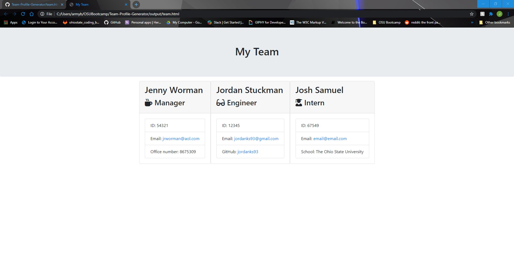
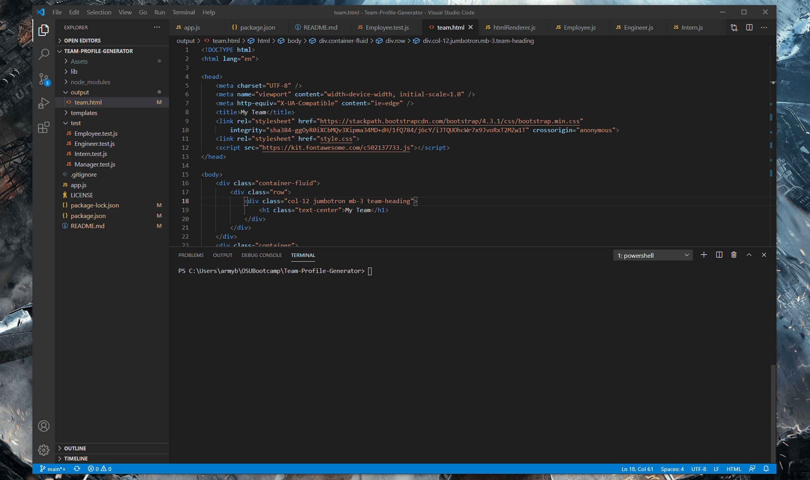

# Team Profile Generator

  ## Description
  The application will prompt the user for information about the team manager and then information about the team members. The user can input any number of team members, and they may be a mix of engineers and interns. This assignment must also pass all unit tests. When the user has completed building the team, the application will create an HTML file that displays a nicely formatted team roster based on the information provided by the user.
  
  

  ## Table of Contents
  * [Installation](#installation)
  * [Usage](#usage)
  * [Credits](#credits)
  * [Contributions](#contributions)
  * [Testing](#testing)
  * [Questions](#questions)
  * [License](#license)
   
  ## Installation
  1.) Clone the repo from github 2.) Pull up the project in your file directory 3.) Type "npm i" into the console to install the required modules 4.) Type "node app.js" to run the program 5.) Follow the prompts until team.html is generated in the output folder.
    
  ## Usage
  You will need node installed for this project. Jest is also needed for testing.
  ## Credits
  Jordan Stuckman
  ## Contributions
  Contact me by email or just submit a pull request.
  ## Testing
  npm run test
  ## Questions
  If you have any questions or feedback, contact me at jordanks93@gmail.com.
  My github profile is jordanks93.
  ## License
  MIT

